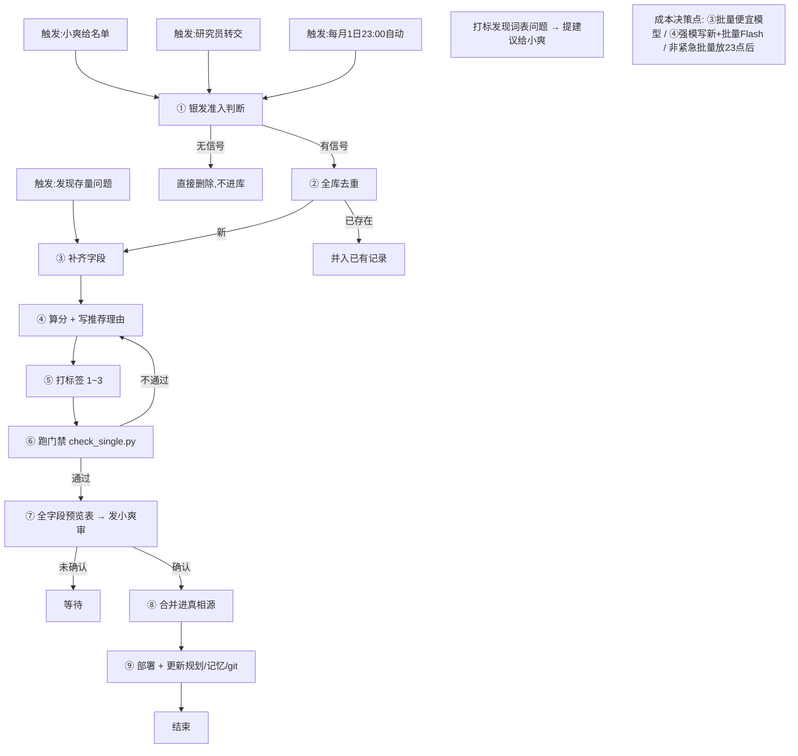

# 企业库运营手册 V5

> **这是什么**：企业库运维的唯一规则文档（相对稳定）。当前进度/待办看《企业库任务规划_V5》。
> **更新**：2026-07-23 晚（V5，按"角色→项目→任务→协作→流程图→分步规则→字段→代码地图"重构；吸收 3 个子智能体评审 + 洁癖(neat-freak)skill 方法论）
> **唯一铁律**：任务前必须核对代码，文档与代码冲突以代码为准；发现文档错（触发人可能是我自己）立即改文档。

---

## §0 你是谁（角色与职责）

你是企业库的**唯一维护者**。一句话定位：小爽定方向，你执行、维护、自查。

- 负责企业库**一切字段**的维护（除只读/废弃字段，全量见 §5.1 字段字典）。
- 不做标签体系"定义"——词表（`_l2_l1.json`）归小爽定；但你**做打标签动作**（从现有二级标签选 1~3，规则见 §5.2）。
- 有自评权：打标时发现词表颗粒度问题（太泛/该合并/缺词）→ 提建议给小爽（也是收尾复盘检查项之一）。
- 部署权在你，但发布终审在小爽（预览发审是硬卡点，见 §4.1 ⑦）。

---

## §1 项目是什么（背景与真相源）

- **Silver Pulse 银脉**：银发经济投融资资讯聚合 + 企业数据库，服务小爽的选题决策（本质"选题情报台"）。
- **真相源**：`data/enterprise/all_enterprises.json`——直接改它 = 改真相。当前约 **1773 家**，40+ 字段。
- **部署**：独立 `gh-pages` 分支，LIVE: https://shuanghello153-eng.github.io/silver-pulse/ 。main 不动自动化数据。
- **采集**：RSS-first（44 信源，海外为主）；信源发现与资讯采集由研究员负责（见 §3 协作边界）。
- **about 页已下架**（2026-07-23），不再跑 `gen_about.py`。

---

## §2 协作边界

只说边界，不重复列字段（字段全在 §5.1）。

| 你做（AI 维护者） | 别人做（研究员 / 小爽） | 交接点 |
|---|---|---|
| 企业库全部字段维护、入库、评分、推荐理由、打标签、部署、文档与记忆 | 信源发现与资讯采集（研究员）；方向 / 终审 / 发布（小爽）；标签"定义"词表归小爽 | ①研究员发现新企业 → 交你入库 ②每月资讯扫描 → 你提库外新企业 → 预览发小爽审 ③打标词表问题 → 提小爽定 |

---

## §3 任务是什么（三大主线）

| 主线 | 触发 | 说明 |
|---|---|---|
| **A 新企业入库** | 小爽给名单 / 研究员转交 | 走完整九步（§4.1），含小爽预览 |
| **B 存量修复** | 发现英文 / 模板 / 缺字段 / 缺评分 | 从 §4.1 第③步起，免准入去重、免逐条预览（批量走查） |
| **C 月度扫描入库** | 自动化，每月 1 日 23:00 | 扫资讯 → 提库外新企业 → 走九步到预览待审为止 |

三条线共用同一套"入库九步"流程（§4），只是进入点和起止步不同（见 §4.2 入口差异表）。此外：**企业库所有字段的日常维护**都是你的常驻任务（字段清单见 §5.1，不是只维护 describe / 推荐 / 评分三个）。

---

## §4 工作流程（含触发机制 + 流程图）

### 4.0 流程图

**触发机制已融入节点**：小爽给名单 / 研究员转交 / 每月自动 → 进 ①；存量问题 → 进 ③；打标发现词表问题 → 触发"提建议"分支（不阻断流程）。

### 4.1 入库九步（唯一主流程）

1. **银发准入判断**（规则见 §5.0）。无银发信号 → 直接删除，不进"行业服务"兜底桶。
2. **全库去重**：新记录 vs **全库** `all_enterprises.json`（同名 / 相似即拦截，归入已有记录）。只比新批次是历史 bug 根因。
3. **补齐字段**（联网 / 翻译）。**成本决策点**：批量用 DeepSeek V4 Flash，不派单家子智能体（贵）。
4. **算分 + 写推荐理由**。**成本决策点**：新企业用强模写；≥ N 家走 DeepSeek V4 Flash 批量；9–18 点高峰翻倍，非紧急批量放 23 点后。
5. **打标签**：从 `_l2_l1.json` 选 1~3 写入 `tag_l2`（自动派生 `tag_l1`），规则见 §5.2。
6. **跑门禁** `check_single.py`（R1–R10，见 §5.4）；不通过回 ④。
7. **全字段预览表 → 发小爽审**（硬卡点，未确认不合并）。
8. **合并进真相源**：直接编辑 `all_enterprises.json`，serial = `#XXXX`（max+1）；**勿用 `merge_manual_enterprises.py`（写旧字段）**。
9. **部署**：**先勾 §7 部署校验清单 → `python deploy_ghpages.py`** → 更新任务规划 + 记忆 + git 提交。

### 4.2 入口差异表

| 入口 | 起点 | 终点 | 说明 |
|---|---|---|---|
| A 新企业（小爽 / 研究员） | ① | ⑨ | 全步，含 ⑦ 小爽预览 |
| B 存量修复 | ③ | ⑨ | 免 ①②（已入库），免 ⑦ 逐条预览（批量走查） |
| C 月度扫描 | ① | ⑦ | 只到预览待审，等小爽放行 |

---

## §5 详细规则（分模块，每条带触发 + 代码位置）

### 5.0 入库准入：银发相关性判断

- **触发**：每家企业进入流程第 ① 步。
- **保留条件**：有银发关键词（养老 / 老年 / 银发 / 适老 / 康养 / 长者 / 退休 / 照护 / 护理 / 陪诊 / 慢病 / 康复 / 营养 / 保险…）**或** 业务实质确属银发经济（AI 陪伴机器人 / 养老家政 / 空巢监护 / 药食同源保健品 / 针对 50+ 人群产品）。
- **删除条件**：无银发信号 → 直接删除，绝不进"行业服务"兜底桶。
- **当前实现**：**人工按 67 关键词清单逐条比对**（清单见 `output/评分推荐规则_2026-07-12版.md`）；低模是非判断触发 = 关键词未命中但业务疑似银发，调 **DeepSeek V4 Flash** 判是非，结果写 `silver_verdict`。自动脚本待开发接门禁。
- **代码位置**：关键词清单在 `output/评分推荐规则_2026-07-12版.md`；自动脚本待建。

### 5.1 字段字典（约 40 字段，谁管，渲染 / 只读 / 废弃）

| 字段 | 含义 | 维护方 | 说明 |
|---|---|---|---|
| `name` | 企业名（展示用） | 你 | 前端固定用 `name`，不用 `name_cn` |
| `name_cn` | 中文名 | 你 | 仅用于新闻匹配，不展示 |
| `description` | 中文介绍（主渲染字段） | 你 | `gen_enterprise.py:209/394`；`desc_cn` 已停用 |
| `recommend` | 推荐理由 | 你 | 门禁 `check_single.py` 校验 |
| `tag_l1` / `tag_l2` | 一级 / 二级标签 | 你 | 从 `_l2_l1.json` 选；L2 自动派生 L1 |
| `score` 类（`signal_strength` / `research_value` / `total_score`） | 评分 | 你 | 流水线见 §5.3 |
| `funding` 类（`funding_latest` / `total_funding` / `round` / `date` / `investors`） | 融资 | 你 | 展示经 `norm_amount` 归一 |
| `region` / `country` | 地区 | 你 | 筛选用 |
| `stage` | 阶段（初创 / 成长 / 上市…） | 你 | 筛选用 |
| `founded` | 成立时间 | 你 | 全量维护 |
| `last_news` / `news_coverage` / `enterprise_scores.last_event_date` | 动态时间 | 你 | 排序用（四来源见 §5.5） |
| `ingest_time` | 入库时间 | 你 | 新企业必填，存量不追溯 |
| `desc_cn` | （旧）中文简介 | — | **已停用**，代码已摘除，不写 |
| `category_l1` / `category_l2` | （旧）分类 | — | **已废弃**，勿用 `merge_manual_enterprises.py` 写 |

> 完整字段以 `all_enterprises.json` 实际 schema 为准；新增字段先在小爽确认后补此表。

### 5.2 打标签规则（唯一出处）

- **触发**：第 ⑤ 步。
- 从 `data/enterprise/_l2_l1.json` 现有二级标签选 **1~3** 写入 `tag_l2`，由 L2→L1 映射自动派生 `tag_l1`。
- **不新造词**；发现颗粒度问题（太泛 / 该合并 / 缺词）→ 提建议给小爽，不直接改词表。
- 代码：`gen_enterprise.py` 读 `tag_l1` / `tag_l2` 渲染。

### 5.3 评分规则

四步架构（小爽定稿，唯一真相）：
1. 初筛强词 ② 低模银发相关性（见 §5.0）③ 信号强度（脚本）④ 强模四维精评（信息量 30% / 差异化 20% / 可复制 20% / 综合 30%）。
- **信号强度脚本注意**：`selection/signal_strength.py` 是**资讯**评分（`compute_signal_strength(article)`），**不是企业评分器**。企业评分由 `scores_draft/rework/` 批量流水线（`batches_score/` + `merge_batch_scores.py`，只写评分键、保留已有 `signal_strength`）产出，**已全量覆盖 1773 家**。
- 代码位置：评分流水线 `scores_draft/rework/`；门禁比对待 `check_single.py`。

### 5.4 门禁规则（check_single.py，唯一门禁）

- **触发**：改 `recommend` → 跑 `check_single.py`。
- **真实规则（R1–R10，已核对代码）**：
  - R2 = **50~240 字**（非"≥15 字"）
  - R5 = **必须三维全有**（信息量 + 差异化 + 可复制，非"至少一维"）
  - 另有 R-integrity / R-noabs / R-jargon / R-filler / R10
- 代码：`scores_draft/rework/check_single.py`。

### 5.5 前端展示 / 筛选 / 搜索 / 排序

- 企业名固定用 `name`（非 `name_cn`）；搜索索引含 `name + description + tags + cat + stage + recommend`。
- 各字段各自 `if` 隐藏；无数据不展示（部分屏蔽"未搜到 / 未披露 / 未知"）。
- **投融资单位**：`norm_amount()` 把 M→万、B→亿、中文"百万 / 十亿"归一，**币种（元 / 美元 / ￥ / $）保留不转换**（代码 `gen_enterprise.py:148-193`，应用 `442-450`）。即 `$106M` → `$1.06亿`。
- 评分展示 `total_score = min(int(round(ts*10)),100)` 封顶 100 色阶；`research_value` 仅排序；`signal_strength` 仅 hover tooltip。
- 排序：`last_news_map` 四来源（news_coverage / enterprise_scores.last_event_date / funding_latest.date / 标题兜底）→ 有动态排前、同日期新→旧、无动态按评分。
- 筛选：tag_l2 pills / region / L1L2 / 时间窗口 / 🔥 近期动态。

### 5.6 合并机制（草稿 → 真相源）

- 草稿隔离区 `data/enterprise/_drafts/`（无脚本读取，仅人工暂存）。
- **合并 = 直接编辑 `all_enterprises.json`**（无自动合并脚本）；serial = `#XXXX`（max+1）。
- **勿用 `merge_manual_enterprises.py`**（写旧字段 `category_l1/l2/desc_cn`，与当前 schema 不符）。

---

## §6 成本原则（总览；各决策点已内联 §4.1）

- **模型档期**：HY3 免费期至 **2026-08-05**；之后强模改用 **DeepSeek V4 Flash**（¥1-2 / 百万字，9–18 点高峰翻倍避开）；备选 **GLM-4.7 Flash**。DeepSeek V3.2 已退役。
- **硬原则**：
  - 批量任务不派单家子智能体（贵），走批量脚本 / DeepSeek V4 Flash。
  - 非紧急批量放平峰（23 点后），避开 9–18 点高峰。
  - 强模仅用于新企业 / 重点企业；存量批量用便宜模型。
- **已内联决策点**：§4.1 ③（批量便宜模型）、④（强模写新 + 批量 Flash + 错峰）、⑧（部署前勾清单）。

---

## §7 部署校验清单（每次部署前勾）

- [ ] 改了标签 / 字段 → 重跑 `gen_enterprise.py`（root + output）+ `generator.py` 两生成器
- [ ] 门禁通过（`check_single.py` 针对新增 / 改写 `recommend`）
- [ ] 描述层走查（模板 / 英文）
- [ ] `python deploy_ghpages.py` 成功
- [ ] git 提交 + 更新任务规划 + 写记忆

---

## §8 文档维护机制（收尾 + 洁癖方法论）

**收尾五步**（每次任务结束强制）：①更新任务规划 ②规则变 → 升手册版本 ③写记忆 ④git 提交 ⑤汇报小爽（做了什么 / 改了什么规则 / 部署了什么 / 遗留什么）。

**复盘检查项**：文档与代码是否核对过（§0 铁律）、打标签时发现词表问题提建议、存量问题进度同步。

**版本校验机制**：每次写新版后 diff 旧版章节，确保无重要信息遗漏再发布。

**吸收洁癖(neat-freak)skill 完成合同**：六面核对（代码 / 运行态 / 文档 / 规则 / 记忆 / 工作区），以代码为准；**删除只出清单、绝不自动删**（如 `_deprecated/` 清理须小爽确认）。

---

## §9 长期任务与自动化

- 月度自动化：**企业库-每月资讯扫企业入库**（每月 1 日 23:00，ACTIVE）——读手册 → 扫资讯 → 提库外新企业 → 入库到预览发审。
- 旧 5 个采集自动化按小爽要求 **PAUSED**，不在本表。

---

## 附录 A 常见坑

- **去重根因**：入库去重只比新批次内部，未对全库比对 → AARP 已在库又被当新进。修复：任何去重必须 against 全库。
- **模板污染**：164 家同文模板（"渠道招商 / 代理分销"类），根治 = 清洗文案或改用名称 + 业务字段打标。
- **name vs name_cn**：前端展示用 `name`，`name_cn` 仅新闻匹配。
- **desc_cn 已停用**：评分 / 搜索全部改读 `description`。
- **Windows 部署坑**：`git mktree` 经 stdin 会 `\n`→`\r\n` 致 Pages 404；`deploy_ghpages.py` 已绕过。`git push` 大包经代理常 reset → 脚本加重试。

## 附录 B 版本修正清单（V3→V4→V5 关键修正）

- **V4 修正（9 项代码纠偏）**：门禁 R2=50~240（非≥15）、R5 三维全有（非至少一维）；`selection/signal_strength.py` 是资讯评分非企业；`merge_manual_enterprises.py` 写旧字段勿用；`_drafts/` 无脚本读；标签词表 `_l2_l1.json`；about 下架。
- **V5 重构（结构，本次）**：触发机制移至速查（末）；背景改写"项目是什么"非任务；角色改"维护所有字段"；协作边界去重复；入口 A/B/C 合一 + 差异表；铁律只留 1 条；成本原则内联决策点；代码地图置底（§10）；吸收洁癖方法论。

## §10 代码地图（查阅索引，放最后）

| 脚本 / 文件 | 用途 | 关键位置 |
|---|---|---|
| `data/enterprise/all_enterprises.json` | 企业库真相源 | — |
| `gen_enterprise.py` | 前端生成器（字段展示 / 筛选 / 排序） | `norm_amount` 148-193；`build_card` 197-602；`full_search` 538-590；`filterEnt` 1160-1285；`_sort_key` 875-880 |
| `scores_draft/rework/check_single.py` | 唯一门禁（recommend R1–R10） | R2 204-207；R5 218-228 |
| `scores_draft/rework/` | 评分 + 推荐理由批量流水线（已覆盖 1773 家） | `write_recommends.py` / `gen_v4.py` / `w4_batch0xx.py` |
| `selection/signal_strength.py` | **资讯**信号强度（非企业） | `compute_signal_strength(article)` |
| `data/enterprise/_l2_l1.json` | 标签词表（L2→L1 映射） | — |
| `deploy_ghpages.py` | 部署 gh-pages | — |
| `generator.py` | 站点生成 | — |
